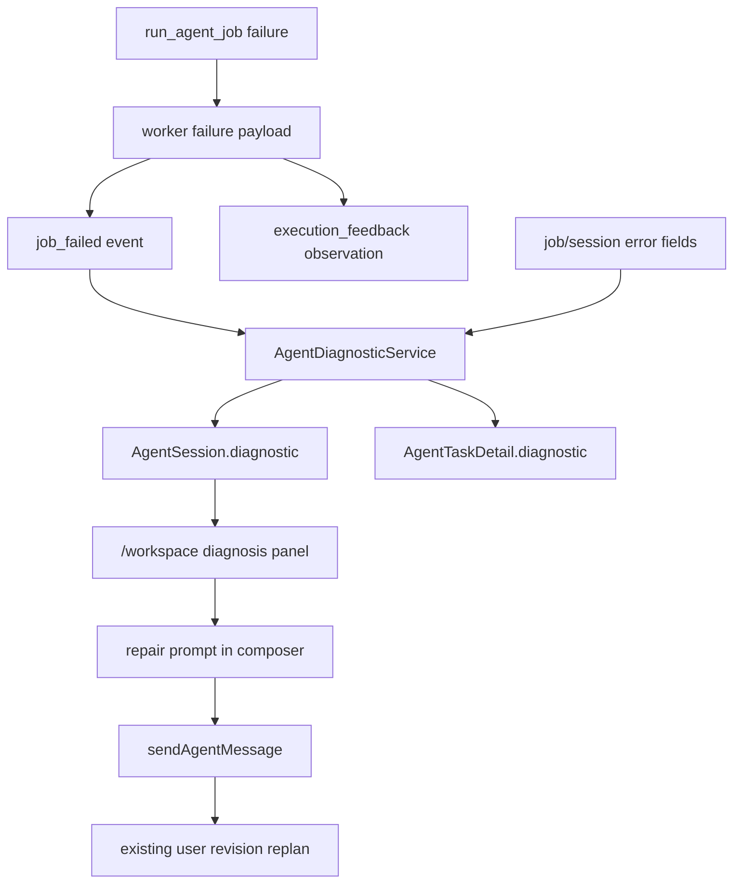

# Workspace Agent Diagnostics And Repair Design

## Background

ClipForge now has a usable `/workspace` planning loop:

1. The user creates a brief.
2. The backend produces a persisted plan.
3. The user can revise the plan.
4. LangChain-driven user revision replanning can create a new plan version.
5. `/workspace` can detect a real `currentPlanVersion` increase and show that the plan was updated.

The execution side has also grown beyond a simple best-effort worker. `run_agent_job(...)` now records job progress, failed steps, retryable step hints, structured worker failure payloads, and execution-feedback replans. Some failures already include useful fields such as `failureCategory`, `primaryProvider`, `providerDiagnostics`, `sceneDiagnostics`, and `retryStrategyHint`.

The gap is product visibility and control. When a job fails or recovers through automatic execution-feedback replanning, `/workspace` still mostly says "go to tasks and inspect the timeline". That is understandable for developers, but not enough for a small-scale product user. The user needs to know what failed, why it failed, and what they can do next.

## Problem

The current failure experience has three issues:

1. Failure diagnostics are stored inconsistently as raw event payloads, job error text, step errors, and session errors. The frontend has to infer meaning from low-level fields.
2. `/workspace` does not expose a stable, user-facing diagnosis. It shows the failed step and a generic message, but not the provider, scene, category, or recommended action.
3. The user has no safe repair path from `/workspace`. They can type another message, but the UI does not explain what kind of message would help or whether the system already attempted an execution-feedback replan.

This makes failures feel opaque. It also makes external-source issues look like random product breakage, even when the system already knows the failure is "no inventory", "provider blocked", "download unavailable", or "render dependency missing".

## Goal

Build the first product-grade failure diagnosis loop for `/workspace`:

1. Normalize execution failure information into a stable `diagnostic` contract.
2. Return the diagnostic on both `AgentSession` and `AgentTaskDetail` when available.
3. Show a concise diagnosis panel in `/workspace` failure states.
4. Give the user one safe manual repair path from the failure panel.
5. Reuse the existing message/replan flow instead of introducing a new retry engine.

The product goal is:

> A user should understand what blocked the agent and have one obvious next action that feeds useful repair context back into the planning loop.

## Non-Goals

This stage does not do the following:

- No full automatic retry UI.
- No task-level retry implementation.
- No background self-healing loop beyond the existing execution-feedback replan.
- No plan version history or visual diff.
- No full planner trace explorer.
- No provider account health dashboard.
- No new external provider integration.
- No database migration unless implementation proves current event/session storage is insufficient.
- No broad redesign of `/tasks`.

## Approaches Considered

### Approach A: Improve Copy Only

Add better failure text in `/workspace`, derived from the existing `error.message`.

Pros:

- Very small implementation.
- No backend contract changes.

Cons:

- Still relies on string parsing or vague messages.
- Cannot reliably show provider, scene, category, or repair advice.
- Does not help task detail or future API consumers.

This is too shallow for the next product stage.

### Approach B: Normalize Diagnostics From Existing Payloads

Add a stable diagnostic read model that is built from existing job failed events, job records, session error fields, and step errors.

Pros:

- Reuses data that already exists.
- Keeps write-path risk low.
- Makes `/workspace` and `/tasks` consume the same product-level diagnosis.
- Does not require a new retry engine.

Cons:

- Needs careful fallback behavior for old failures that only have `error_message`.
- Some diagnostic fields may be unknown until providers emit richer errors.

This is the recommended approach.

### Approach C: Build A Full Repair Workflow

Add explicit repair jobs, retry queues, provider switching, plan diffing, and user approval before retry.

Pros:

- Long-term shape is powerful.
- Could eventually support a real agent recovery workflow.

Cons:

- Too large for the next stage.
- Hard to verify without more stable provider behavior.
- Risks hiding basic diagnostic gaps behind a bigger workflow.

This should come later.

## Recommended Direction

Use **Approach B: Normalize Diagnostics From Existing Payloads**.

The implementation should treat the current worker failure payload as source material, then expose a small stable contract:

```ts
type AgentDiagnosticSeverity = 'info' | 'warning' | 'error'

interface AgentDiagnostic {
  phase: 'planning' | 'search_assets' | 'prepare_assets' | 'render_video' | 'unknown'
  category: 'no_inventory' | 'provider_blocked' | 'download_failed' | 'render_failed' | 'planning_failed' | 'unknown'
  title: string
  message: string
  primaryProvider: string | null
  failedSceneIds: number[]
  providerDiagnostics: Array<Record<string, unknown>>
  sceneDiagnostics: Array<Record<string, unknown>>
  retryStrategyHint: string | null
  repairPrompt: string
  severity: AgentDiagnosticSeverity
}
```

Exact field names can be adjusted during implementation, but the contract should stay small and stable.

## User Experience

### Workspace Failure Panel

When `session.status === 'failed'` or a failed step exists, `/workspace` should show a diagnosis panel inside the existing failure section.

The panel should include:

- Failed phase label, using standard step names.
- A short diagnosis title.
- A readable message.
- Provider if known, such as `Pexels` or `YouTube`.
- Affected scenes if known.
- A recommended next action.

Example copy:

- Title: `素材搜索没有找到可用结果`
- Message: `YouTube 没有为场景 2 返回可下载候选素材。`
- Action hint: `可以补充更宽泛的关键词，或指定一个更容易检索的画面方向。`

### Manual Repair Action

The first repair action should be intentionally conservative:

- Button: `用建议修复方案继续修改`
- Behavior: fill the composer with `diagnostic.repairPrompt` and focus it.
- The user still sends the message manually.

This keeps control with the user and reuses the existing `sendAgentMessage(...) -> replan` path. It also avoids promising that one click will retry execution, which the product does not safely support yet.

The generated prompt should be concrete, for example:

```text
请根据这次失败调整方案：场景 2 在 YouTube 没有找到可下载素材。请放宽检索关键词，优先选择更通用、容易找到真实素材的画面方向，并保持总时长不变。
```

### Existing Execution-Feedback Replan Awareness

When the backend already attempted an execution-feedback replan and requeued a replacement job, the UI should not show the failure as unresolved if the current session is queued/running again.

Instead, `/workspace` can show a small note in the execution handoff:

- `已根据上一次失败自动调整方案并重新入队`

This should be derived from existing events such as `job_requeued_after_replan`, not from fragile string matching.

## Backend Contract

### Read Model

Add a diagnostic field to backend response models:

- `AgentSession.diagnostic: AgentDiagnostic | None`
- `AgentTaskDetail.diagnostic: AgentDiagnostic | None`

Task summaries do not need the full diagnostic in this phase. They can keep status, current step, and current step id.

### Diagnostic Construction

Create a small service or helper, for example:

- `backend/services/agent_diagnostic_service.py`

Responsibilities:

1. Read the latest relevant failure source:
   - latest `job_failed` event payload
   - job error fields
   - session error fields
   - failed step error
2. Normalize worker payload keys:
   - `failedSceneIds`
   - `failureReason`
   - `failureCategory`
   - `primaryProvider`
   - `providerDiagnostics`
   - `sceneDiagnostics`
   - `retryStrategyHint`
   - `retryableStep`
3. Map low-level step values to user-facing phases:
   - `planning` -> `planning`
   - `searching` or `search_assets` -> `search_assets`
   - `downloading` or `prepare_assets` -> `prepare_assets`
   - `rendering` or `render_video` -> `render_video`
4. Generate stable fallback values when payloads are old or incomplete.
5. Generate `repairPrompt`.

### Category Mapping

Use explicit mappings first, then fallback:

- Existing `failureCategory` should be preserved when it matches a supported category.
- Provider messages containing blocked/auth/rate-limit style signals may map to `provider_blocked`.
- Download-specific failures may map to `download_failed`.
- Render-stage failures map to `render_failed`.
- Planning-stage failures map to `planning_failed`.
- Unknown cases map to `unknown`.

The first implementation should avoid overfitting many string cases. Prefer deterministic mappings from structured fields and a small number of obvious fallback checks.

## Frontend Contract

### Types

Add shared frontend types in `src/lib/agentApi.ts`:

- `AgentDiagnosticSeverity`
- `AgentDiagnostic`

Then include:

- `AgentSession.diagnostic`
- `AgentTaskDetail.diagnostic`

### Workspace UI

Update `BriefWorkspacePage.tsx` failure section to:

1. Prefer `session.diagnostic` when present.
2. Fallback to existing `failedStep?.error?.message` / `session.error?.message`.
3. Render diagnosis fields in compact rows.
4. Render `用建议修复方案继续修改` when `diagnostic.repairPrompt` is non-empty.

The repair button should:

1. Set composer text to `diagnostic.repairPrompt`.
2. Focus the composer.
3. Not automatically submit.

### Task Detail UI

This phase adds only a minimal detail display in the task modal:

- Show diagnosis title and message in failed task detail.
- Keep retry button disabled until real retry exists.

Do not add task-level repair actions in this phase. `/workspace` remains the primary repair surface.

## Data Flow



## Error Handling

Diagnostic construction must be best-effort:

- Missing event payload should not break session reads.
- Malformed provider diagnostics should be ignored or passed through as opaque records.
- Unknown categories should produce a generic diagnosis.
- Old sessions with only `error_message` should still produce a readable title/message.
- Empty `repairPrompt` should hide the repair button.

## Testing Strategy

Backend tests:

- Diagnostic service builds a `no_inventory` search diagnostic from a structured `job_failed` payload.
- Diagnostic service falls back from plain `job.error_message`.
- `AgentReadService.read_session(...)` includes `diagnostic` for failed sessions.
- `AgentTaskReadService.read_task(...)` includes `diagnostic` for failed tasks.
- Existing execution-feedback replan tests continue to pass.

Frontend contract tests:

- `src/lib/agentApi.ts` defines `AgentDiagnostic` and exposes it on `AgentSession`.
- `BriefWorkspacePage.tsx` renders the diagnosis panel fields.
- The repair action fills the composer rather than auto-submitting.

Build verification:

```bash
/Users/linkwind/Code/ClipForge_v2/.venv/bin/python -m unittest \
  tests.test_agent_backend \
  tests.test_agent_jobs \
  tests.test_agent_persistence -v

npm run build
```

Focused tests should be used during TDD before running the broader commands.

## Scope Boundaries

Files likely to change:

- `backend/models/agent.py`
- `backend/services/agent_diagnostic_service.py`
- `backend/services/agent_read_service.py`
- `backend/services/agent_task_read_service.py`
- `src/lib/agentApi.ts`
- `src/lib/taskApi.ts`
- `src/components/workspace/BriefWorkspacePage.tsx`
- possibly `src/components/tasks/TaskManagerPage.tsx`
- `tests/test_agent_backend.py`
- `tests/test_agent_jobs.py`
- `tests/test_agent_persistence.py`

Avoid changing:

- Search provider implementations unless a diagnostic source field is clearly missing.
- Celery job dispatch behavior.
- Planner graph behavior.
- The external `/api/agent/sessions/{id}/messages` shape.
- The current disabled retry stance in `/tasks`.

## Acceptance Criteria

1. Failed sessions can return a stable `diagnostic` object.
2. Failed task details can return the same diagnostic shape.
3. `/workspace` shows a useful diagnosis when a failed session has diagnostic data.
4. `/workspace` can place a suggested repair prompt into the composer without auto-submitting it.
5. Old failures without structured payloads still show a generic but readable diagnosis.
6. Running/requeued sessions do not show stale unresolved failure panels.
7. Existing plan revision, grounding, execution-feedback replan, and task detail tests remain green.

## Future Work

After this phase, good follow-up stages are:

1. Task detail diagnosis parity and richer event grouping.
2. A real controlled retry action for selected failed phases.
3. Provider health/status checks in settings.
4. Plan diff/history for repair-generated versions.
5. Automatic repair policy controls for hosted beta users.
